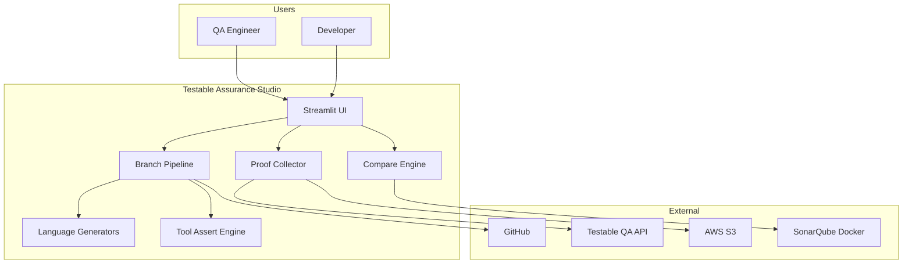
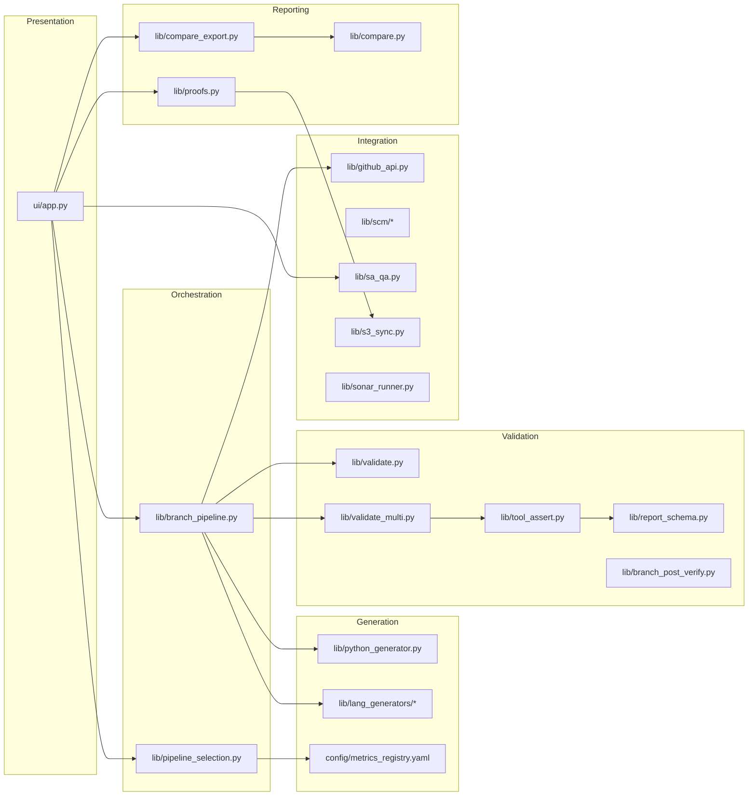
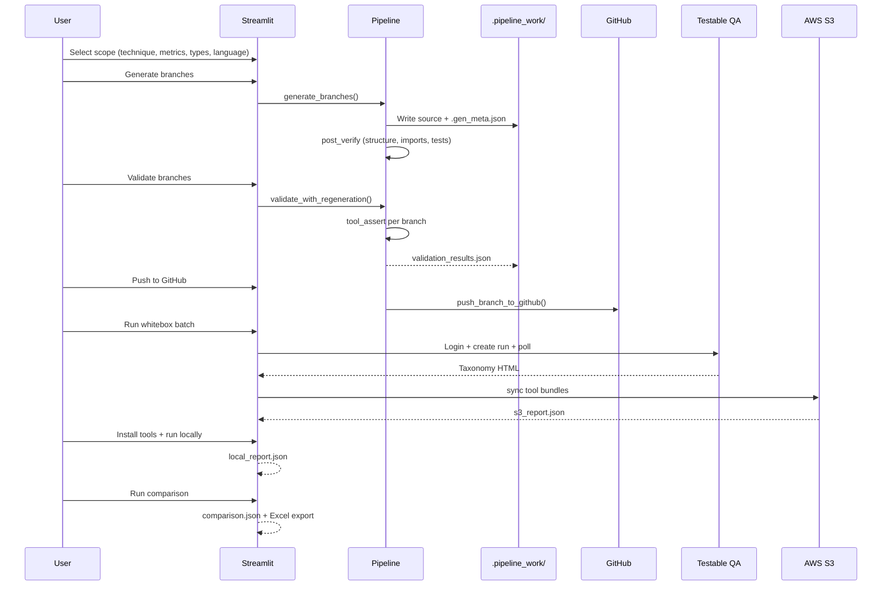

# High-Level Design (HLD)

## 1. Purpose

Testable Assurance Studio automates **metric branch assurance** — the process of proving that generated code branches behave correctly under QA tools and that platform reports (Testable taxonomy, S3 tool bundles, local execution, SonarQube) agree.

The system serves three primary goals:

1. **Generate** synthetic branches that encode intentional defects (Bug), fixes (BugFX), tool-configured passes (TCC), and smoke passes (CC) for every metric in the Testable strategy registry.
2. **Validate** that each branch structurally matches its type and that assigned QA tools produce the expected outcome.
3. **Assure** end-to-end by running whitebox on Testable, collecting proofs, and comparing report sources.

---

## 2. Scope

### In scope

| Area | Description |
|------|-------------|
| Branch generation | 14 techniques × 103 metrics × 4 branch types = **412 branches** per taxonomy version |
| Languages | Python, Java, C#, TypeScript, JavaScript with per-language runtime selectors |
| Local validation | Registry-driven tool asserts with strength escalation and auto-regeneration |
| GitHub integration | OAuth App + optional PAT; per-user repo selection |
| Whitebox | Testable QA login, catalog sync, taxonomy HTML export, S3 proof download |
| Local tools | Isolated venv execution of primary/secondary tools per branch |
| SonarQube | Optional Docker-based community scan |
| Comparison | S3 vs local vs Sonar with taxonomy as reference; Excel export |

### Out of scope (current release)

- Production hosting (tracked separately under TP-2263)
- Non-Python whitebox for all languages (Java/C#/TS/JS generate locally; whitebox platform support varies)
- Automated CI/CD for the Streamlit app itself

---

## 3. System context



---

## 4. Logical architecture



---

## 5. Core concepts

### 5.1 Metric registry

Single source of truth: `config/metrics_registry.yaml`

- **14 technique groups** (SA, RM, CQ, LR, SX, DR, ST, BR, PC, MU, DP, DF, …)
- **103 L5 metrics**, each with `module_key`, `branch_slug`, primary/secondary tools per language
- **4 branch types**: Bug, BugFX, TCC, CC

Branch naming convention:

```
{TECH}_{Branch-Slug}_{BranchType}_{Version}
```

Example: `SA_Decision-Outcome-Verification_Bug_2.6`

The **Version** field is the taxonomy label (e.g. `2.6`), not the programming-language runtime.

### 5.2 Branch types

| Type | Intent | Tool outcome |
|------|--------|--------------|
| **Bug** | Intentional metric violation | FAIL |
| **BugFX** | Defect remediated | PASS or WARN |
| **TCC** | Tool-config-correct pass | PASS or WARN (TCC config active) |
| **CC** | Smoke / default-path pass | PASS or WARN (no TCC config) |

See [TOOL_ASSERTS.md](TOOL_ASSERTS.md) for per-family thresholds.

### 5.3 Strength escalation

Generation uses a **strength** parameter (0–N) that controls how aggressively defects or complexity are injected. Validation runs tool asserts; on failure the pipeline can regenerate at higher strength (up to `Max fix attempts per branch`).

### 5.4 Proof bundle

Each whitebox-completed branch accumulates artifacts under `proofs/{TECH}/{branch_name}/`:

| File | Source |
|------|--------|
| `taxonomy_report.html` | Testable QA export |
| `s3_report.json` | AWS S3 tool bundle |
| `local_report.json` | Local tool execution |
| `sonar_report.json` | SonarQube scan (optional) |
| `comparison.json` | Cross-source diff |

### 5.5 Comparison verdicts

| Verdict | Meaning |
|---------|---------|
| **MATCH** | S3, local, and Sonar agree on metric status |
| **PARTIAL** | Some sources agree; others missing or N/A |
| **MISMATCH** | Sources disagree (actionable finding) |
| **INCOMPLETE** | Required reports not yet collected |

Taxonomy is **reference-only** — used to cross-check whether S3 aligns with the platform classification.

---

## 6. Data flow



---

## 7. Multi-language design

| Language | Generator | Build verify | Runtime stored in |
|----------|-----------|--------------|-------------------|
| Python | `lib/python_generator.py` | pytest, import check | `.gen_meta.json` → `RUNTIME_VERSION` |
| Java | `lib/lang_generators/java.py` | Maven/JUnit (optional javac) | pom.xml compiler level |
| C# | `lib/lang_generators/csharp.py` | dotnet build (optional) | Target framework |
| TypeScript | `lib/lang_generators/ts_js.py` | tsc (optional) | tsconfig target |
| JavaScript | `lib/lang_generators/ts_js.py` | Node/npm test | package.json engines |

Shared case logic lives in `lib/lang_generators/case_emit.py` and `meta_common.py`. Dispatch is through `lib/lang_generators/template_core.py`.

Default runtimes are defined in `lib/lang_support.py`.

---

## 8. Security & credentials

| Secret | Storage | Used for |
|--------|---------|----------|
| Testable QA email/password | Session only (Streamlit) | Whitebox login |
| GitHub OAuth | `scm_connections.db` (encrypted token) | Push under user identity |
| `GITHUB_TOKEN` | `.env.local` | PAT fallback for push |
| AWS keys | `.env.local` (STS, hourly refresh) | S3 proof download |
| `SCM_TOKEN_SECRET` | `.env.local` | Encrypt OAuth tokens at rest |

Never commit `.env.local`. See [04-setup-and-configuration.md](04-setup-and-configuration.md).

---

## 9. Non-functional requirements

| Requirement | Implementation |
|-------------|----------------|
| Responsiveness | Whitebox auto-preview gated at 12 branches (`WHITEBOX_AUTO_PREVIEW_LIMIT`) |
| Isolation | Per-user pipeline work dirs (`.pipeline_work/{hash}/`) |
| Idempotency | `hydrate_gen_rows_from_work()` survives Streamlit reruns |
| Graceful degradation | Missing JDK/dotnet/tsc skips compile verify; tools SKIPPED not false-pass |
| Auditability | Excel export with mismatch detail, S3/local columns, row highlighting |

---

## 10. Deployment topology (planned)

Hosting is tracked under Jira TP-2263:

```
Browser → HTTPS reverse proxy → Streamlit :8501 → Metric_evaluation
                                      ↓
                         .env.local + .pipeline_work/ + proofs/
```

Minimum server: Python 3.12+, 8 GB RAM, 20 GB disk, outbound GitHub/AWS/QA access.
