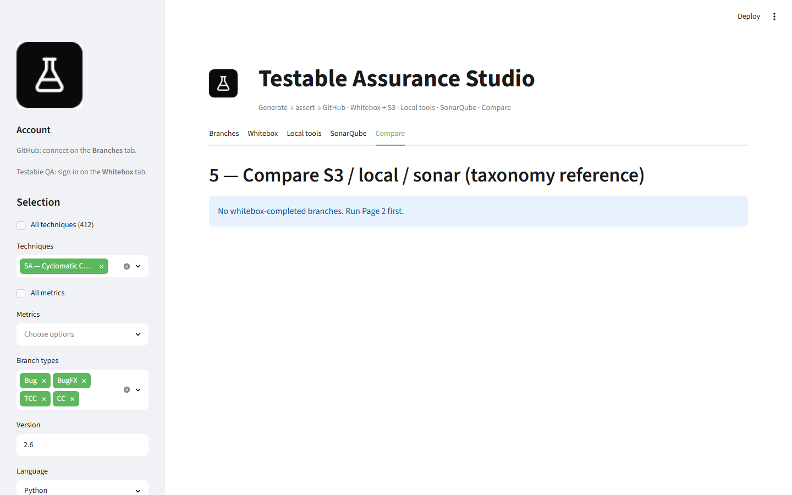
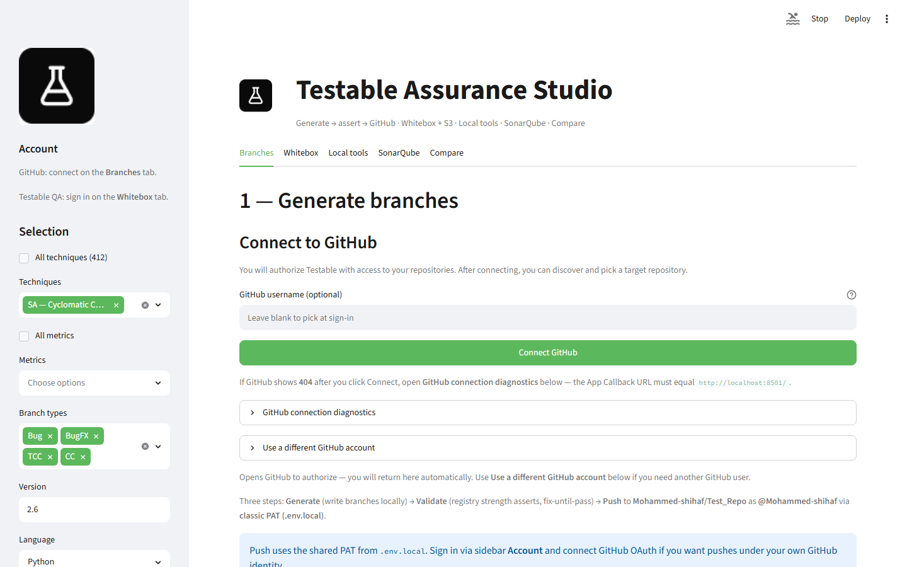
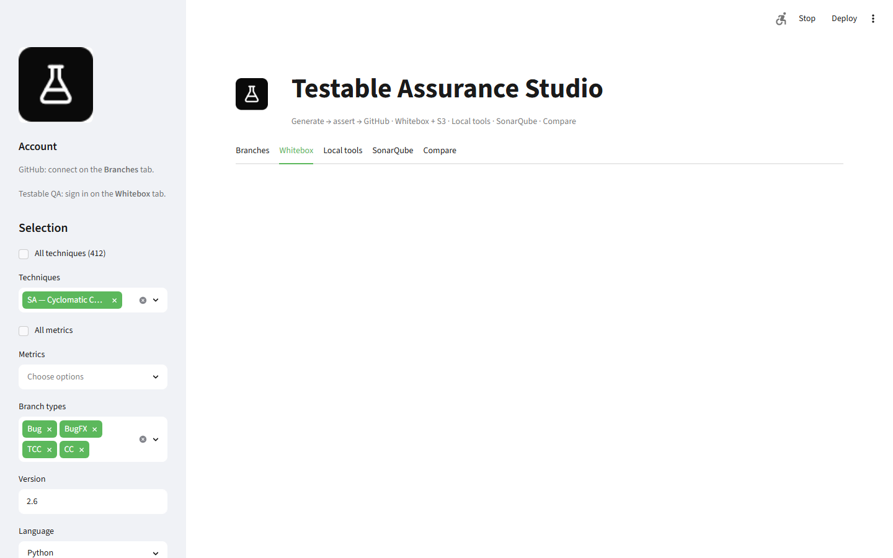
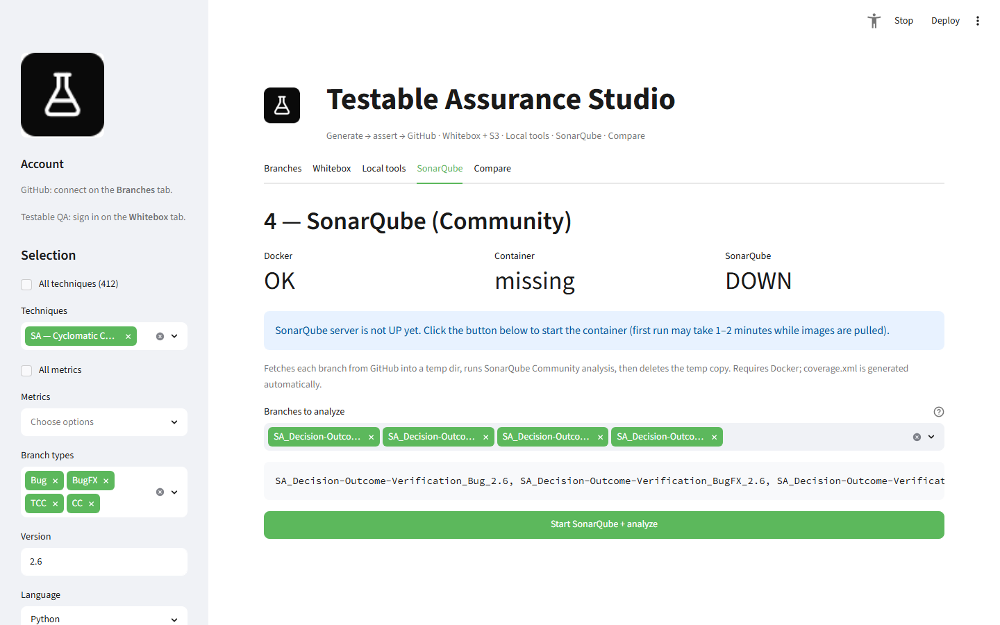

# Functional Guide

This guide describes every user-facing feature in Testable Assurance Studio with screenshots captured from the live UI.

---

## 1. Application shell

The app opens at **http://localhost:8501** with a wide layout, logo header, and five main tabs.


**Header caption:** `Generate → assert → GitHub · Whitebox + S3 · Local tools · SonarQube · Compare`

| Tab | Step | Primary actions |
|-----|------|-----------------|
| **Branches** | 1 | Generate, Validate, Push to GitHub |
| **Whitebox** | 2 | QA login, run whitebox batch, collect taxonomy + S3 |
| **Local tools** | 3 | Install metric tools, run locally on completed branches |
| **SonarQube** | 4 | Start Sonar Docker, scan branches |
| **Compare** | 5 | Cross-check S3 / local / Sonar, export Excel |

---

## 2. Sidebar — scope & credentials



### 2.1 Selection filters

| Control | Description |
|---------|-------------|
| **All techniques (412)** | When checked, includes all 14 technique groups |
| **Techniques** | Multiselect: SA, RM, CQ, LR, SX, DR, ST, BR, PC, MU, DP, DF, … |
| **All metrics** | When checked, all metrics for selected techniques |
| **Metrics** | Multiselect with `TECH:CODE` tokens (e.g. `SA:DOV`, `RM:DPR`) |
| **Branch types** | Bug, BugFX, TCC, CC (default: all four) |
| **Version** | Taxonomy version label (default `2.6`) |
| **Language** | Python, Java, C#, TypeScript, JavaScript |
| **Runtime version** | Per-language toolchain (e.g. Python 3.12, Java 17, net8.0) |

Changing any filter updates **In scope: N branches** and resets in-memory pipeline state when the scope key changes.

### 2.2 Account & integrations

| Section | Purpose |
|---------|---------|
| **Testable QA** | Sign in for whitebox runs (session-only credentials) |
| **GitHub** | OAuth connect, repo picker, disconnect / switch account |
| **Credential audit** | Shows QA / S3 / GitHub readiness indicators |

**Gate:** GitHub must be connected and a target repository selected before Generate is enabled (unless using PAT fallback from `.env.local`).

---

## 3. Tab 1 — Branches



### 3.1 Three-step pipeline

| Button | Action | Prerequisites |
|--------|--------|---------------|
| **1 — Generate branches** | Writes branch source to `.pipeline_work/{user-hash}/` | GitHub connected + repo selected |
| **2 — Validate branches** | Runs structure checks + tool asserts; auto-regenerates on failure | Generate complete for all in-scope branches |
| **3 — Push to GitHub** | Pushes validated branches to remote | All branches pass validation |

### 3.2 Options

| Option | Default | Effect |
|--------|---------|--------|
| Max fix attempts per branch | 2 | Regeneration rounds after failed assert |
| Auto-install tools to fix validation | on | Installs primary tool into app venv on failure |

### 3.3 Status table

After each stage, a dataframe shows per-branch:

- `branch_name`, `technique`, `metric`, `branch_type`
- `generated`, `validated`, `on_github`
- `strength`, `tool_outcome`, `assert_status`
- Error messages and score progress (strength escalation)

### 3.4 GitHub push panel

Shows connection status, push method (OAuth vs PAT), and per-branch remote presence. Whitebox tab is blocked until all in-scope branches show `on_github: yes`.

---

## 4. Tab 2 — Whitebox



### 4.1 Prerequisites

- All in-scope branches pushed to GitHub
- Testable QA signed in via sidebar

### 4.2 Features

| Feature | Description |
|---------|-------------|
| **Push gate table** | Confirms each branch exists on GitHub before whitebox |
| **Branch picker** | Choose subset for whitebox batch (default: all in scope) |
| **Run whitebox batch** | Authenticates → catalog sync → create run → poll → export taxonomy |
| **S3 proof collection** | Downloads tool bundles from AWS after run completes |
| **Status table** | Per branch: whitebox status, taxonomy, S3, gate score |
| **Refresh status** | Manual re-fetch for large scopes (>12 branches auto-preview is gated) |

### 4.3 Whitebox statuses

| Status | Meaning |
|--------|---------|
| COMPLETED | Run finished; taxonomy available |
| NOT_COMPLETED | Not yet run or catalog not synced |
| FAILED | Run error (see detail column) |

### 4.4 Large scope behavior

When more than **12 branches** are in scope, expensive API previews are deferred. An info banner prompts you to click **Refresh status** manually. This keeps the UI responsive when selecting all metrics.

---

## 5. Tab 3 — Local tools


### 5.1 Scope

Only branches with whitebox status **COMPLETED** appear here.

### 5.2 Actions

| Button | Effect |
|--------|--------|
| **Install tools + run locally** | Creates isolated throwaway venv per batch, installs primary tool, executes against branch source |
| **Tool doctor** | Checks which registry tools are installed on the host |

### 5.3 Results

Per branch:

- Tool name (from registry primary_tool)
- Local status: PASS / FAIL / WARN / SKIPPED
- `failure_layer` when assert disagrees with flat metric threshold
- Download link for `local_report.json`

### 5.4 Branch-type legend

The UI explains that Bug branches expect FAIL, BugFX/TCC/CC expect PASS or WARN, with branch-type-aware `tool_outcome` taking precedence over raw metric values.

---

## 6. Tab 4 — SonarQube



### 6.1 Optional integration

SonarQube Community runs in Docker. Requires Docker Desktop or compatible runtime.

| Control | Description |
|---------|-------------|
| **Start SonarQube server** | Launches `sonarqube:community` container |
| **Run Sonar scan batch** | Scans whitebox-completed branches |
| Server status | Shows host URL, container health |

If Docker is unavailable, the tab shows setup instructions and comparison proceeds without Sonar (marked N/A).

---

## 7. Tab 5 — Compare


### 7.1 Report readiness

Table columns:

| Column | Description |
|--------|-------------|
| taxonomy_ref | Platform taxonomy label (reference) |
| s3 | S3 tool bundle collected |
| local | Local tool report collected |
| sonar | SonarQube report collected |
| can_compare | At least S3 or local available |
| missing | What's still needed |

### 7.2 Run comparison

Click **Run comparison** to build per-branch `comparison.json` verdicts.

Summary banner: `MATCH=N PARTIAL=N MISMATCH=N INCOMPLETE=N`

### 7.3 Per-branch detail

Each branch expander shows:

- **Styled diff table** — green rows = match, red = mismatch
- Columns labeled **S3 Data**, **Local Data**, **Sonar Data**
- Side-by-side metric values and tool execution flags
- Download buttons for individual JSON reports

### 7.4 Excel export

**Export comparison workbook** produces an `.xlsx` with:

| Sheet | Contents |
|-------|----------|
| Summary | Per-branch verdict + mismatch detail (red highlight) |
| Matches | Aligned fields with green highlighting |
| Mismatches | S3 Data, Local Data, S3 vs Local columns, tool executed flags |

---

## 8. Multi-language generation

Selecting a non-Python language changes codegen output:

| Language | Project layout | Test framework | Local tool runner |
|----------|----------------|----------------|-------------------|
| Python | `pkg/config.py`, pytest | pytest + coverage | pip venv + native CLIs |
| Java | Maven `src/main/java`, JUnit 5 | `mvn test` | JaCoCo, PMD, SpotBugs, PIT (when Maven present) |
| C# | `.csproj`, xUnit | `dotnet test` | coverlet, SecurityCodeScan, Stryker.NET (when SDK present) |
| TypeScript | `package.json`, tsconfig | `tsc` + node runner | eslint, nyc/c8 (when Node present) |
| JavaScript | `package.json` | node test runner | eslint, nyc/c8, jscpd (when Node present) |

Runtime version is stored in `.gen_meta.json` and branch config as `RUNTIME_VERSION`.

Language is auto-detected per branch from `.gen_meta.json` throughout validate, local-tools, whitebox, and compare. The sidebar **Language** filter is a fallback hint when metadata is missing.

### Native tool execution

Local tool asserts no longer require `RUN_NATIVE_BUILD=1`. When a host toolchain is present (`toolchain_available()`), real native tools run and results include `real_tool: true`. When a toolchain is absent, checks return **SKIPPED** (structural surrogate) — never a false pass.

Post-generation verify runs language test suites when toolchains are available (`mvn test`, `dotnet test`, node tests). Missing toolchains skip the test gate gracefully.

Language caption under sidebar confirms generate/validate/whitebox readiness per language.

---

## 9. Multi-technique metric selection

When selecting metrics from multiple techniques (e.g. SA + RM + CQ), use qualified tokens:

```
SA:DOV
RM:DPR
CQ:ABPO
```

The registry parser (`parse_qualified_metrics`) routes each token to the correct technique without ValueError.

---

## 10. Keyboard & UX notes

- Streamlit reruns the script on every interaction; pipeline state persists via `.pipeline_work/` and session state.
- Long operations show a **RunPanel** progress bar with per-branch status.
- OAuth callback returns to the app root; GitHub repo picker appears after connect.
- Disconnect GitHub clears the session token but not `.env.local` PAT.

---

## 11. Troubleshooting (UI)

| Symptom | Likely cause | Action |
|---------|--------------|--------|
| Generate disabled | No GitHub repo | Connect GitHub, pick repo |
| Push locked | Validation incomplete | Re-run Validate |
| Whitebox shows 0 ready | Branches not on GitHub | Complete Push step |
| Compare empty | No COMPLETED whitebox | Run whitebox batch |
| Page slow with all metrics | Auto-preview gated | Use Refresh status manually |
| PyArrow error on `failed` column | Mixed types in dataframe | Refresh page; known Streamlit edge case |

For deeper process guidance see [03-process-workflows.md](03-process-workflows.md).
