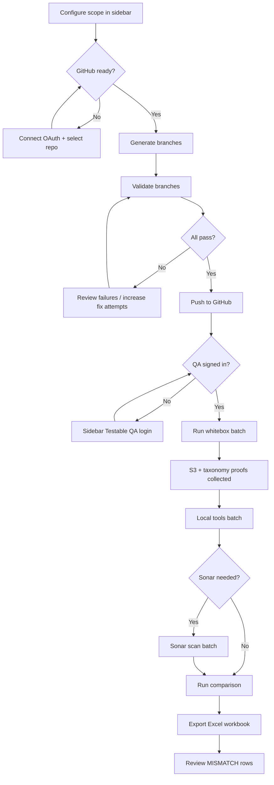
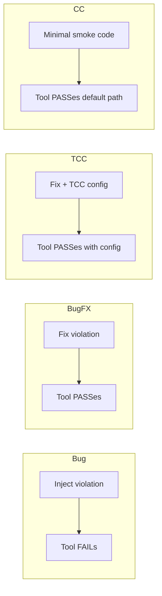

# Process & Workflows

This document defines the **operating procedures** for metric branch assurance — who does what, in what order, and what gates must pass before proceeding.

---

## 1. End-to-end assurance process



---

## 2. Phase definitions

### Phase 0 — Environment preparation

**Owner:** Developer / DevOps

1. Install Python 3.12+, clone repo, `pip install -r requirements.txt`
2. Copy `.env.example` → `.env.local`
3. Configure Testable QA URLs, AWS S3 credentials, GitHub OAuth app
4. Start app: `streamlit run ui/app.py`
5. Verify credential audit in sidebar shows expected green indicators

**Exit criteria:** App loads, sidebar shows filter controls, no startup exceptions.

---

### Phase 1 — Scope selection

**Owner:** QA Engineer

1. Choose techniques and metrics (or check **All techniques** / **All metrics**)
2. Select branch types (typically all four)
3. Set taxonomy **Version** (e.g. `2.6`)
4. Choose **Language** and **Runtime version** for codegen
5. Confirm **In scope: N branches** matches expectation

**Scope examples:**

| Scenario | Techniques | Metrics | Branches |
|----------|------------|---------|----------|
| Smoke | SA | DOV | 4 |
| Technique slice | SA | all | ~24 |
| Multi-technique | SA + RM + CQ | selected | varies |
| Full registry | all | all | 412 |

**Exit criteria:** Branch count displayed; scope key stable.

---

### Phase 2 — Generate

**Owner:** QA Engineer

**Inputs:** Scope filters, GitHub repo connection

**Process:**

1. Open **Branches** tab
2. Click **1 — Generate branches**
3. Monitor progress panel — each branch writes to `.pipeline_work/{user-hash}/{branch_name}/`
4. Post-verify runs: structure asserts, import check, pytest (or language equivalent)

**Artifacts:**

- Branch source tree per metric
- `.gen_meta.json` (language, runtime, strength, LOC metadata)
- Config file with `RUNTIME_VERSION`, technique/metric keys

**Exit criteria:** All in-scope rows show `generated: yes`, no verify errors.

**Failure handling:**

| Failure | Action |
|---------|--------|
| LOC mismatch | Check CC complexity marker (`neutral-` vs `simple-`) |
| Import error | Review generator output for selected language |
| Incomplete folder | Click Validate to repopulate from GitHub fetch |

---

### Phase 3 — Validate

**Owner:** QA Engineer

**Process:**

1. Click **2 — Validate branches**
2. For each branch:
   - Structural validation (`lib/validate.py` / `validate_multi.py`)
   - Tool assert (`lib/tool_assert.py`) — runs primary tool
   - Branch-type outcome check via `metric_violation()`
3. On failure with auto-install enabled: install tool, regenerate at higher strength, retry
4. Results saved to `validation_results.json` in work dir

**Expected outcomes by branch type:**

| Type | tool_outcome | assert_status |
|------|--------------|---------------|
| Bug | FAIL | PASS (assert expects FAIL) |
| BugFX | PASS or WARN | PASS |
| TCC | PASS or WARN | PASS |
| CC | PASS or WARN | PASS |

**Exit criteria:** All rows `validated: yes`, `assert_status: PASS`.

---

### Phase 4 — Push

**Owner:** QA Engineer (GitHub identity)

**Process:**

1. Click **3 — Push to GitHub**
2. Push uses GitHub App OAuth token (or PAT fallback)
3. Each branch pushed to configured repo under user's identity

**Exit criteria:** Push gate shows `on_github: yes` for every in-scope branch.

**Gate:** Whitebox tab remains blocked until push gate passes.

---

### Phase 5 — Whitebox

**Owner:** QA Engineer

**Prerequisites:** Push complete, Testable QA signed in

**Process:**

1. Open **Whitebox** tab
2. Confirm push gate table (all green)
3. Select branches (or accept default all in-scope)
4. Click **Run whitebox batch**
5. Pipeline stages:
   - Authenticate → resolve catalog → create run → poll completion
   - Export taxonomy HTML to `taxonomy_reports/`
   - Sync S3 tool bundles to `proofs/` and `s3_downloads/`

**Exit criteria:** At least target branches show `COMPLETED` with taxonomy collected.

**Known constraint:** Testable catalog may not expose all pushed branches immediately. Re-run batch after catalog sync if some show NOT_COMPLETED despite being on GitHub.

---

### Phase 6 — Local tools

**Owner:** QA Engineer

**Prerequisites:** Whitebox COMPLETED for target branches

**Process:**

1. Open **Local tools** tab
2. Review scoped branches (whitebox-completed only)
3. Click **Install tools + run locally**
4. Isolated venv created per batch when `LOCAL_TOOL_ISOLATED=true`
5. Primary tool executed; report normalized via `report_schema.py`

**Exit criteria:** `local_report.json` exists per branch in proof bundle.

**Interpretation:** A Bug branch showing local FAIL is **correct**. A TCC branch showing FAIL may indicate a real mismatch worth investigating in Compare.

---

### Phase 7 — SonarQube (optional)

**Owner:** QA Engineer

**Process:**

1. Ensure Docker running
2. **SonarQube** tab → Start server → Run scan batch
3. Reports saved as `sonar_report.json`

**Exit criteria:** Sonar reports present OR explicitly skipped (comparison marks N/A).

---

### Phase 8 — Compare & export

**Owner:** QA Engineer / Auditor

**Process:**

1. Open **Compare** tab
2. Review readiness table
3. Click **Run comparison**
4. Inspect per-branch expanders (styled green/red rows)
5. Click **Export comparison workbook** for audit package

**Verdict actions:**

| Verdict | Action |
|---------|--------|
| MATCH | No action — sources agree |
| PARTIAL | Collect missing reports, re-run prior phase |
| MISMATCH | Investigate field-level diff; may indicate platform bug or local tool gap |
| INCOMPLETE | Run missing collection step |

---

## 3. Branch-type assurance matrix

Each metric generates **four branches**. Together they prove the tool can detect defects and recognize fixes.



| Branch type | Code marker | Config files | Tool config |
|-------------|-------------|--------------|-------------|
| Bug | `bug-` fingerprint | Standard | None |
| BugFX | `fix-` fingerprint | Standard | None |
| TCC | `tcc-` fingerprint | TCC-specific (.coveragerc, etc.) | Active |
| CC | `neutral-` fingerprint | Standard | None |

---

## 4. Strength escalation workflow

When validation fails:

```
strength=0 → assert FAIL → regenerate strength=1 → retry
           → assert FAIL → regenerate strength=2 → retry
           → stall detection (3 rounds no progress) → mark failed
```

Configurable via **Max fix attempts per branch** (0–5).

Score progress UI shows strength history per branch.

---

## 5. Comparison logic (detailed)

For each completed branch, `collect_comparison_proof()` builds a proof bundle comparison:

1. Load taxonomy reference label from whitebox export
2. Parse S3 report JSON (tool metrics, execution metadata)
3. Parse local report JSON (tool outcome, metric values)
4. Parse Sonar report if present
5. Field-level diff with normalization via `report_schema.py`
6. Assign verdict:

```
if missing required sources → INCOMPLETE
elif all comparable fields match → MATCH
elif some fields match → PARTIAL
else → MISMATCH
```

Excel export adds human-readable mismatch columns: **S3 Data**, **Local Data**, **S3 vs Local**, tool executed flags.

---

## 6. Roles & responsibilities

| Role | Responsibilities |
|------|------------------|
| **QA Engineer** | Scope selection, generate/validate/push, whitebox, local tools, compare |
| **Platform Admin** | Testable QA tenant, catalog sync, S3 bucket access |
| **DevOps** | Hosting, `.env.local` secrets, GitHub App registration, Docker |
| **Developer** | Generator fixes, registry updates, tool assert tuning |

---

## 7. Audit checklist

Use this checklist before signing off a metric or technique slice:

- [ ] All 4 branch types generated for each metric in scope
- [ ] Validate assert_status PASS for all branches
- [ ] All branches on GitHub (push gate)
- [ ] Whitebox COMPLETED with taxonomy HTML saved
- [ ] S3 report collected (or SKIPPED documented)
- [ ] Local tool report collected
- [ ] Comparison run with verdict recorded
- [ ] Excel workbook exported and archived
- [ ] MISMATCH rows investigated or ticketed

---

## 8. Demo script (4-branch smoke)

For a minimal SA/DOV demo, follow [e2e-demo/E2E_WALKTHROUGH.md](e2e-demo/E2E_WALKTHROUGH.md).

Quick path:

1. Sidebar: SA, metric DOV, all 4 types, version 2.6
2. Branches → Generate → Validate → Push
3. Whitebox → login → Run batch
4. Local tools → Install + run
5. Compare → Run → Export

Expected: 4 branches in scope; at least one whitebox COMPLETED for comparison demo.
